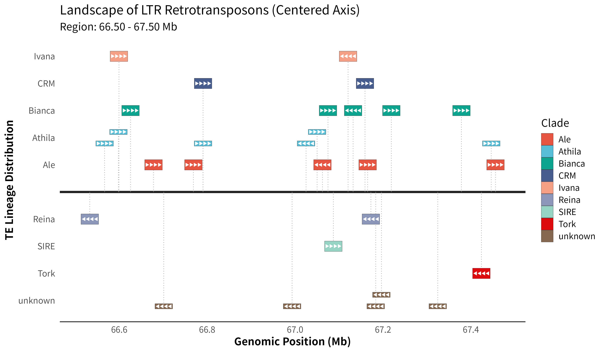

# LandscapeLTR

An R package for visualizing the distribution landscape of LTR retrotransposons along genomic regions with a centered axis layout.

## Description

LandscapeLTR provides functions to read, process, and plot LTR retrotransposon data. The package creates publication-quality visualizations with a balanced layout where clades are distributed symmetrically above and below a central axis, making it easy to compare different TE lineages across genomic regions.

## Installation

To install the package from source:

```r
# Install devtools if not already installed
if (!require("devtools")) install.packages("devtools")

# Install LandscapeLTR
devtools::install("path/to/LandscapeLTR")
```

## Quick Start

```r
library(LandscapeLTR)

# Load example data
data(ltr_example)

# Create a plot
plot_ltr_landscape(ltr_example, target_region = c(66.0, 67.5))
```

## Usage

### Basic Usage

```r
# From a data frame
plot_ltr_landscape(data = ltr_example, 
                   target_region = c(66.0, 67.5))

# From a TSV file
plot_ltr_landscape(data = "path/to/your/data.tsv",
                   target_region = c(66.0, 67.5),
                   output_file = "output_plot.pdf")
```

### Advanced Options

```r
plot_ltr_landscape(
  data = ltr_example,
  target_region = c(66.0, 67.5),    # Genomic region in Mb
  min_width_mb = 0.04,               # Minimum element width
  track_height = 0.85,               # Track height
  lane_buffer = 0.005,               # Spacing between lanes
  output_file = "plot.pdf",          # Save to file
  width = 12,                         # Plot width (inches)
  height = 7,                         # Plot height (inches)
  dpi = 300,                          # Resolution for PNG
  title = "Custom Title",             # Plot title
  return_plot = TRUE                  # Return ggplot object
)
```

## Data Format

The input data should be a data frame or TSV file with the following required columns:

- **TE**: Transposable element identifier in format "Chr:Start-End" (e.g., "Chr01:10056333-10060920")
- **Clade**: TE clade classification (e.g., "Ale", "Bianca", "Athila")
- **Strand**: Strand orientation ("+" or "-")

Optional columns:
- **Order**: TE order (e.g., "LTR")
- **Superfamily**: TE superfamily (e.g., "Copia", "Gypsy")
- **Complete**: Whether element is complete ("yes" or "no")
- **Domains**: Protein domains present

## Features

- **Balanced Layout**: Clades are automatically distributed above and below a central axis
- **Automatic Stacking**: Overlapping elements are automatically stacked to avoid visual overlap
- **Strand Indicators**: Arrow markers show strand direction for each element
- **Customizable**: Extensive options for customization of plot appearance
- **Multiple Formats**: Save plots as PDF, PNG, or other formats

## Examples




### Example 1: Basic Plot

```r
data(ltr_example)
p <- plot_ltr_landscape(ltr_example, target_region = c(66.0, 67.5))
print(p)
```

### Example 2: Save to File

```r
plot_ltr_landscape(ltr_example,
                   target_region = c(66.0, 67.5),
                   output_file = "ltr_landscape.pdf",
                   width = 14,
                   height = 8)
```

### Example 3: Custom Title

```r
plot_ltr_landscape(ltr_example,
                   target_region = c(66.0, 67.5),
                   title = "LTR Retrotransposon Distribution in Chromosome 1")
```

## Dependencies

- tidyverse
- ggplot2
- ggsci
- scales

## License

GPL-3

## Author


## Version

1.0.0

